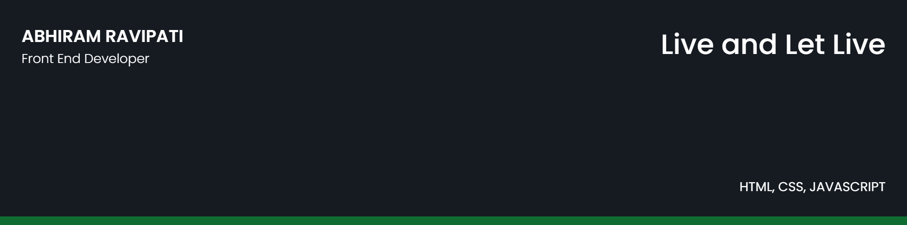

## 🧔 About Me

- 🔭 I’m currently working on HTML, CSS, JAVASCRIPT

- 🌱 I’m currently learning **React, Node, MongoDB**

- 👯 I’m looking to collaborate on **Front-End Projects**

- 💬 Ask me about **React, Web Development and UI/UX**

- 📫 Contact me **[here](abhiramravipati9@gmail.com)**

## ✍ My Work

## 📚 My Skills

<h3 align="left">Connect with me:</h3>

